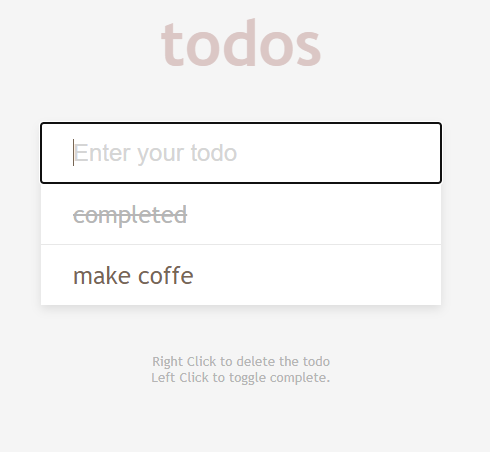

# To do App
## Simple To do App for praticing.
check on : https://todo-aplication.netlify.app

### 🛠 Technologies

The following tools were used in the construction of the project:

  * Javascript

### Features Used

   * Add, Remove and Delete.
   * localStorage

### Pictures 
  Desktop View
  
 
 practice
